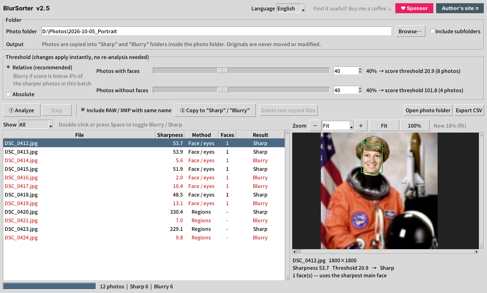
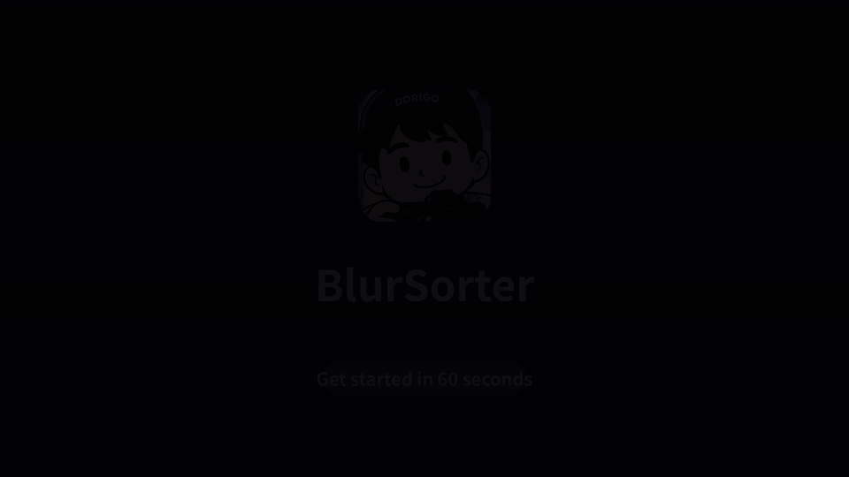

  

<h1 align="center">BlurSorter</h1>

  A photo culling tool that automatically finds blurry, out-of-focus and shaky portrait photos and sorts them into <b>Sharp</b> and <b>Blurry</b> folders — your originals are never touched.

  <a href="README.md">中文</a> ｜ <b>English</b>

  
  
  

  

## 60-second walkthrough

   
  ▶ Click to watch the full video (MP4 with captions)   |   <a href="docs/tutorial-zh.mp4">中文版</a>

---

## Features

Weddings, events and portrait sessions easily produce thousands of frames, and zooming in on each one to check focus takes hours. BlurSorter flags **out-of-focus**, **blurry** and **camera-shake** shots in minutes, so you only need to review the ones it marks — a big time saver when **culling photos**.

- **Made for shallow depth of field.** A blurry background doesn't count against a photo — BlurSorter checks whether the **face and eyes** are sharp, not the average of the whole frame.
- **Works on group shots.** The photo's score comes from the sharpest *main* face, so it passes as long as the subject is in focus. Small faces in the background are ignored.
- **Photos without faces** fall back to region analysis, using the sharpest parts of the image.
- **Zero risk to originals.** Photos are only **copied** into `Sharp` / `Blurry` folders inside the photo folder. Nothing is moved, modified, or deleted.
- **Relative threshold.** Photos are compared against the sharper ones in the same batch, so it adapts to different cameras and lighting without tuning.
- **Review before sorting.** Adjust the threshold live, inspect each photo (up to 800% zoom, auto-centered on the eyes), and override any result by hand.
- **RAW / XMP sidecars** with the same name (`.CR3`, `.NEF`, `.ARW`, `.xmp`, …) are copied along with the JPG.
- **Chinese / English interface**, switchable instantly from the top-right corner.
- **Fully offline.** All analysis runs on your computer; photos are never uploaded.

## Download

### Option 1: Download the exe (recommended)

Get the latest `BlurSorter.exe` from the [Releases](../../releases) page and double-click it. No Python needed.

> On first launch Windows may show "Windows protected your PC". This happens because the program has no paid code-signing certificate. Click **More info** → **Run anyway**.

### Option 2: Build from source

1. Install [Python 3.10+](https://www.python.org/downloads/) and tick **Add python.exe to PATH**.
2. Download this repository (**Code** → **Download ZIP**, or `git clone`).
3. Double-click `build.bat` and wait 1–3 minutes.
4. The program is at `dist\BlurSorter.exe`.

After running `build.bat` once, you can also double-click `run.bat` to start the program without building.

## How to use

1. Choose your photo folder and click **① Analyze**.
2. Click a photo to preview it: **green box** = sharp face, **red box** = blurry face, **gray box** = minor face (not used).
3. If a result looks wrong, drag the threshold slider, or **double-click / press Space** on a photo to flip it manually.
4. Click **② Copy to "Sharp" / "Blurry"**.

Running it again skips files that already exist. To start over, click **Delete last copied files** (only the copies are removed).

### Preview controls

| Action | Result |
|---|---|
| Zoom drop-down / type a number | 5%–800% |
| − / + buttons, Ctrl + wheel | Step zoom (wheel zooms around the cursor) |
| Drag | Pan |
| Wheel / Shift + wheel | Scroll vertically / horizontally |
| Double-click the preview | Toggle Fit / 100% |

Zooming in from Fit centers on the eyes of the sharpest face. The zoom level is kept when you move to the next photo, so you can compare focus quickly.

## How it works

Sharpness is measured with the **variance of the Laplacian**: the more edges and fine detail, the higher the score.

| Photo type | Scoring |
|---|---|
| With faces | [YuNet](https://github.com/opencv/opencv_zoo/tree/main/models/face_detection_yunet) finds faces and eye positions. Each face is cropped from the **full-resolution** image and resized to a common size; the eye region counts 70%, the whole face 30%. The photo's score is the highest among main faces (≥ 40% of the largest face). |
| Without faces | The image is split into an 8×8 grid; flat regions are skipped and the 3 sharpest cells are averaged. |

**Relative threshold:** the 75th percentile of scores in the batch is the reference; anything below X% of it (default 40%) is marked blurry.

Images are auto-rotated using EXIF, and non-ASCII paths are supported. Analysis runs in parallel on multiple CPU cores.

### Advanced settings

Constants at the top of `focus_analyzer.py`:

| Setting | Default | Description |
|---|---|---|
| `MAIN_FACE_RATIO` | `0.4` | How big a face must be to count as a main face. To require **everyone** in a group shot to be sharp, set it to `0.7` and change `max(...)` to `min(...)` in `analyze()` |
| `FACE_SCORE_TH` | `0.75` | Face-detection confidence; raise it if you get false detections |
| `REF_PERCENTILE` | `75` | Reference percentile for the relative threshold |
| `TILE_GRID` / `TILE_TOP_K` | `8` / `3` | Grid size and number of cells used for photos without faces |

## FAQ

**Why copy instead of move?**
Windows "Controlled folder access" (ransomware protection) guards Desktop, Documents, Pictures and similar folders. Unsigned programs can't move or delete files there, but they can create new ones. Copying works everywhere and keeps your originals safe.

**Which formats are supported?**
JPG, PNG, TIF, BMP and WEBP are analyzed. RAW files aren't analyzed themselves, but with "Include RAW / XMP with same name" turned on they follow the matching JPG.

**Can I add another language?**
Yes. Add a new language (e.g. `"ja"`) to `STRINGS` in `i18n.py`, translate each entry, and add its name to `LANG_NAMES`. Pull requests are welcome.

## License

Released under the [GNU General Public License v3.0](LICENSE) (or later). You may use, modify and redistribute it, but modified versions you distribute must also be open source under the GPL.

Third-party components and their licenses are listed in [THIRD_PARTY_NOTICES.md](THIRD_PARTY_NOTICES.md).

## Author & support

Made by **Dorigo** — [dorigo-image.com](https://dorigo-image.com)

If BlurSorter saves you time culling photos, you can [buy me a coffee ☕](https://www.paypal.com/ncp/payment/ATJ3PTJAC8RC6)

Bug reports and feature requests are welcome in [Issues](../../issues).
