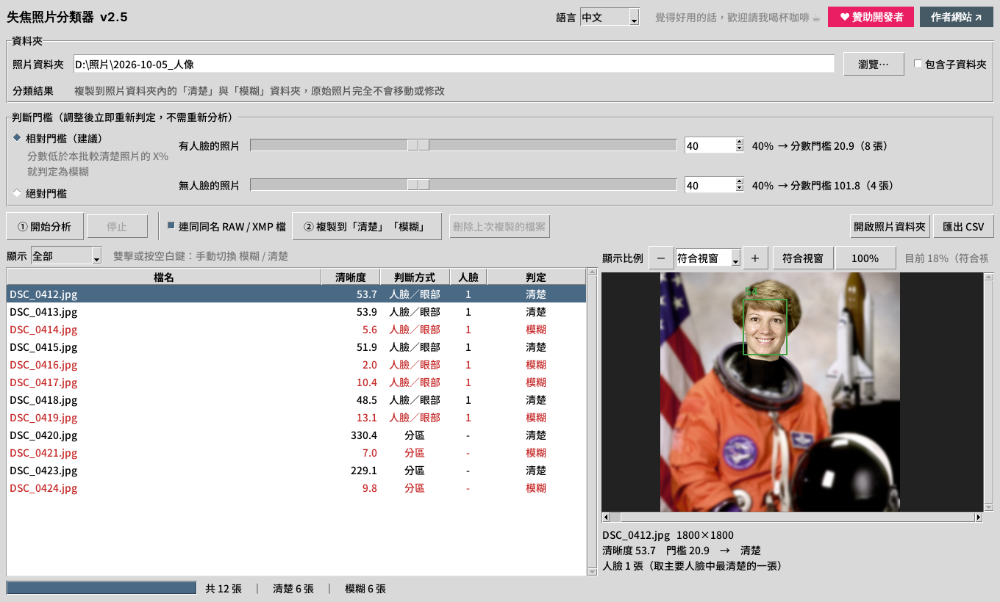

<p align="center">
  
</p>

<h1 align="center">BlurSorter 失焦照片分類器</h1>

<p align="center">
  幫攝影師快速選片：自動挑出失焦、模糊、手震的人像照片，分類到「清楚」與「模糊」資料夾 —— 原始照片完全不動。<br>
  <sub>Photo culling tool for Windows — automatically detects blurry / out-of-focus portrait photos and sorts them into sharp / blurry folders. Face- and eye-aware, made for shallow depth-of-field shots.</sub>
</p>

<p align="center">
  <b>中文</b> ｜ <a href="README.en.md">English</a>
</p>

<p align="center">
  
  
  
</p>

<p align="center">
  
</p>

---

## 特色

婚禮、活動、人像拍攝動輒上千張照片，一張張放大檢查對焦非常耗時。BlurSorter 能在幾分鐘內自動挑出**失焦照片**、**模糊照片**與**手震照片**，讓你只需要確認被標記的那些，大幅縮短**挑照片、選片**的時間。

- **為淺景深人像設計**：背景本來就模糊的照片不會被誤判。程式看的是**臉部與雙眼**是否清楚，不是整張照片的平均。
- **團體照也適用**：取主要人臉中最清楚的一張，只要主角對到焦就算合格；背景的小臉、路人不列入計算。
- **沒有人臉的照片**：自動改用分區判斷，取畫面中最清楚的區塊。
- **原檔零風險**：只**複製**到照片資料夾內的「清楚」「模糊」，不移動、不修改、不刪除任何原始照片。
- **相對門檻**：以同一批照片中較清楚的那些為基準，自動適應不同相機與光線，通常不用調整。
- **先看再分**：可即時調整門檻、逐張預覽（最高 800% 放大、自動對準眼睛），也能手動修正判定。
- **RAW / XMP 一起分類**：同名的 `.CR3`、`.NEF`、`.ARW`、`.xmp` 等檔案會跟著 JPG 一起複製。
- **中文 / English 介面**：右上角即可切換，立即生效，分析結果不會遺失。英文模式的資料夾名稱為 `Sharp` / `Blurry`。
- **完全離線**：所有分析都在本機完成，照片不會上傳到任何地方。

## 下載與使用

### 方法一：直接下載 exe（推薦）

到 [Releases](../../releases) 頁面下載最新版的 `BlurSorter.exe`，點兩下即可執行，不需要安裝 Python。

> 第一次開啟時，Windows 可能顯示「Windows 已保護您的電腦」。這是因為程式沒有付費的數位簽章，按「**其他資訊**」→「**仍要執行**」即可。

### 方法二：自己從原始碼打包

1. 安裝 [Python 3.10 以上](https://www.python.org/downloads/)，安裝時勾選 **Add python.exe to PATH**。
2. 下載本專案（綠色的 **Code** 按鈕 → **Download ZIP**，或 `git clone`）。
3. 雙擊 `build.bat`，等待 1～3 分鐘。
4. 成品在 `dist\BlurSorter.exe`。

跑過一次 `build.bat` 之後，也可以雙擊 `run.bat` 不打包直接執行。

## 使用流程

1. 選擇照片資料夾，按 **① 開始分析**。
2. 點選清單中的照片預覽：**綠框**＝清楚的臉、**紅框**＝模糊的臉、**灰框**＝不列入判斷的次要人臉。
3. 判定不滿意時，拖動門檻滑桿調整，或對照片**雙擊 / 按空白鍵**手動切換。
4. 按 **② 複製到「清楚」「模糊」**。

再次執行時，已存在的相同檔案會自動略過。需要重來時，按「刪除上次複製的檔案」即可（只刪複本）。

### 預覽區操作

| 操作 | 功能 |
|---|---|
| 顯示比例下拉選單 / 直接輸入數字 | 5%～800% |
| －／＋ 按鈕、Ctrl＋滾輪 | 逐級縮放（滾輪以游標為中心） |
| 拖曳 | 移動畫面 |
| 滾輪 / Shift＋滾輪 | 上下 / 左右捲動 |
| 雙擊預覽圖 | 在「符合視窗」與 100% 間切換 |

從「符合視窗」放大時會自動對準最清楚那張臉的雙眼；切換照片時維持比例，方便連續比對。

## 判斷原理

清晰度分數使用**拉普拉斯變異數（Variance of Laplacian）**：影像中的邊緣與細節越多，分數越高。

| 照片類型 | 計分方式 |
|---|---|
| 有人臉 | 以 [YuNet](https://github.com/opencv/opencv_zoo/tree/main/models/face_detection_yunet) 偵測人臉與雙眼位置。每張臉從**原始解析度**裁切並縮放到相同大小，雙眼區域佔 70%、整張臉佔 30%。照片分數＝主要人臉（≥ 最大臉的 40%）中最高的一張。 |
| 沒有人臉 | 照片切成 8×8 格，略過純色區塊，取最清楚的 3 格平均。 |

**相對門檻**：以這批同類照片分數的第 75 百分位為基準，低於基準 X%（預設 40%）即判定為模糊。

判斷前會先依 EXIF 轉正，支援中文路徑。分析使用多執行緒並行處理。

### 進階參數

`focus_analyzer.py` 開頭的常數可以調整：

| 參數 | 預設 | 說明 |
|---|---|---|
| `MAIN_FACE_RATIO` | `0.4` | 多大的臉才算主要人臉。若團體照要求**每個人都清楚**，改成 `0.7`，並把 `analyze()` 裡的 `max(...)` 改成 `min(...)` |
| `FACE_SCORE_TH` | `0.75` | 人臉偵測信心門檻，誤偵測多時調高 |
| `REF_PERCENTILE` | `75` | 相對門檻的基準百分位 |
| `TILE_GRID` / `TILE_TOP_K` | `8` / `3` | 無人臉照片的分格數與取用格數 |

## 常見問題

**為什麼是「複製」而不是「移動」？**
Windows 的「受控資料夾存取」（勒索軟體防護）會保護桌面、文件、圖片等資料夾，未經數位簽章的程式無法移動或刪除裡面的檔案，但可以新增檔案。改用複製後，照片放在桌面也能正常使用，原檔也更安全。

**支援哪些格式？**
分析支援 JPG、PNG、TIF、BMP、WEBP。RAW 檔本身不分析，但勾選「連同同名 RAW / XMP 檔」後會跟著同名的 JPG 一起分類。

**可以加入其他語言嗎？**
可以。在 `i18n.py` 的 `STRINGS` 加一組新的語言（例如 `"ja"`），翻譯每個項目，再把名稱加進 `LANG_NAMES` 即可。歡迎發 Pull Request。

## 專案結構

```
BlurSorter/
├── blur_sorter.py        主程式（tkinter 視窗介面）
├── focus_analyzer.py     清晰度分析核心
├── i18n.py               介面文字（中文 / English），新增語言只要改這個檔案
├── models/
│   └── face_detection_yunet_2023mar.onnx   人臉偵測模型（MIT）
├── icon.png / icon.ico   程式圖示
├── build.bat             一鍵打包成 exe
├── run.bat               不打包直接執行
└── requirements.txt
```

## 授權

本程式以 [GNU General Public License v3.0](LICENSE)（或更新版本）釋出：你可以自由使用、修改與散布，但修改後再發布的版本也必須以 GPL 開放原始碼。

第三方元件與模型的授權見 [THIRD_PARTY_NOTICES.md](THIRD_PARTY_NOTICES.md)。

## 作者與贊助

由 **Dorigo** 開發 —— [dorigo-image.com](https://dorigo-image.com)

如果這個工具幫你省下挑照片的時間，歡迎 [請我喝杯咖啡 ☕](https://www.paypal.com/ncp/payment/ATJ3PTJAC8RC6)

問題回報與功能建議，歡迎開 [Issue](../../issues)。
